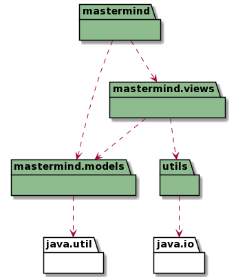
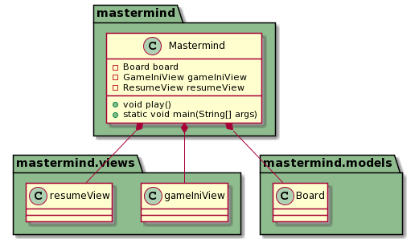
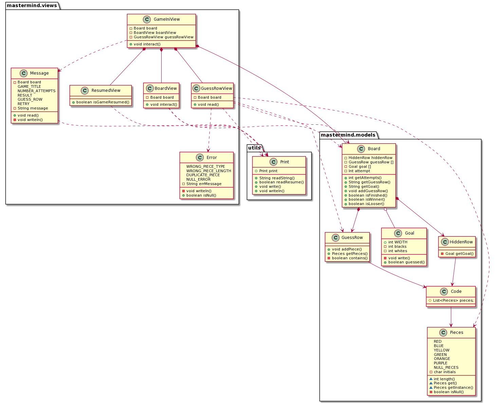

<!DOCTYPE html>
<html lang="en">
<head>
<meta charset="UTF-8">
<meta http-equiv="X-UA-Compatible" content="IE=edge">
<meta name="viewport" content="width=device-width, initial-scale=1.0">
<meta name="author" content="Stefano Lagattolla">
<link rel="stylesheet" href="https://fonts.googleapis.com/css?family=Open+Sans:300,300italic,400,400italic,600,600italic%7CNoto+Serif:400,400italic,700,700italic%7CDroid+Sans+Mono:400,700">
<link rel="stylesheet" href="https://cdnjs.cloudflare.com/ajax/libs/font-awesome/4.7.0/css/font-awesome.min.css">
</head>
<body>
   <h1>Mastermind. DomainModel</h1>
   

    Stefano Lagattolla 
    <a href="mailto:stefanolagattolla.s@gmail.com">stefanolagattolla.s@gmail.com</a> 
    version 0.3.1
   

   

        <ul>
            <li><a href="#arquitectura">Arquitectura</a></li>
            <li><a href="#paquete_mastermind">Package: Mastermind</a></li>
            <li><a href="#paquete_view_model">Package: mastermind.models & mastermind.views</a></li>
        </ul>
   

    

        <h3 style="border-bottom: 1px solid lightgrey">Modelo del Dominio</h3>
        
    

    

        <h3 style="border-bottom: 1px solid lightgrey">Package: Mastermind</h3>
        
    

    

        <h3 style="border-bottom: 1px solid lightgrey">Package: mastermind.models & mastermind.views</h3>
        
    

</body>
</html>